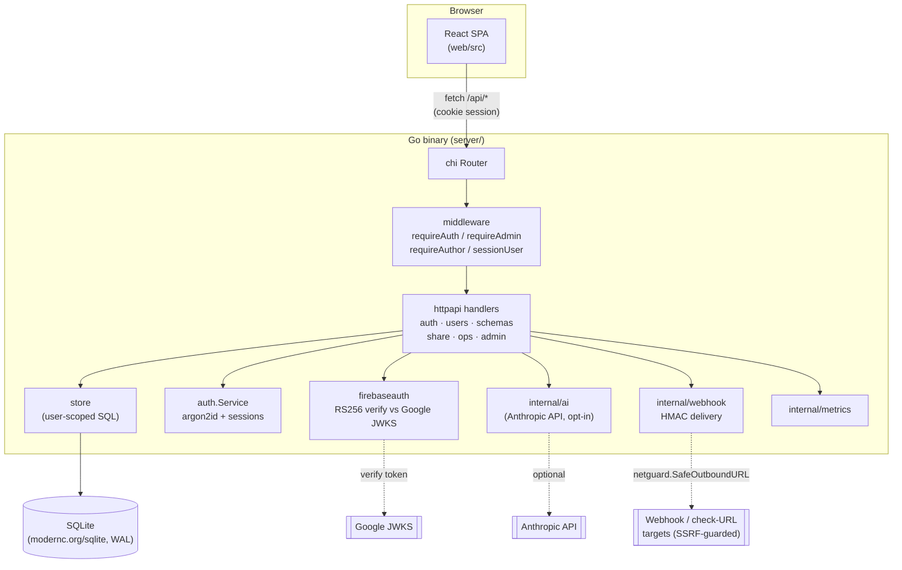
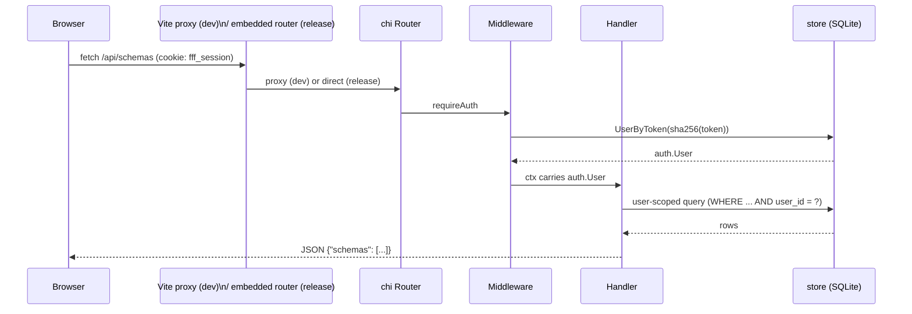
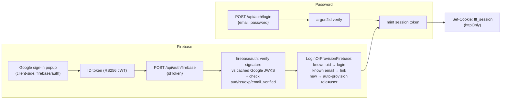
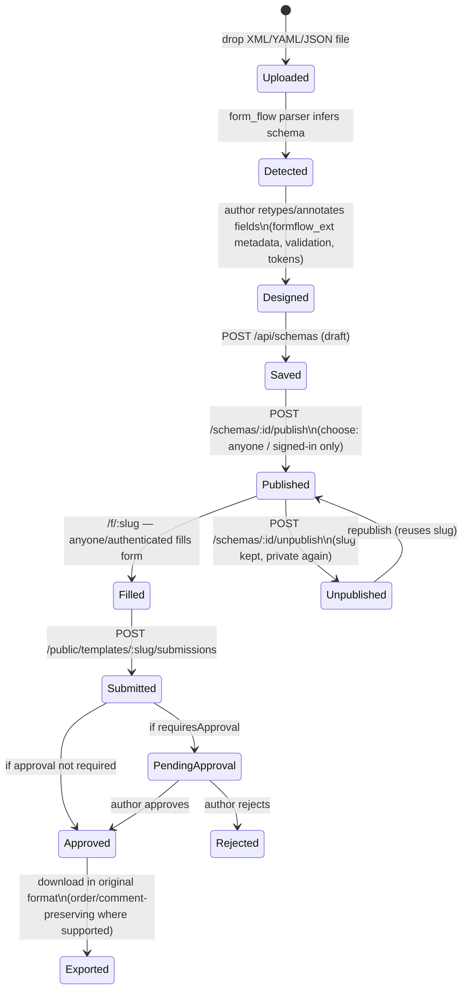
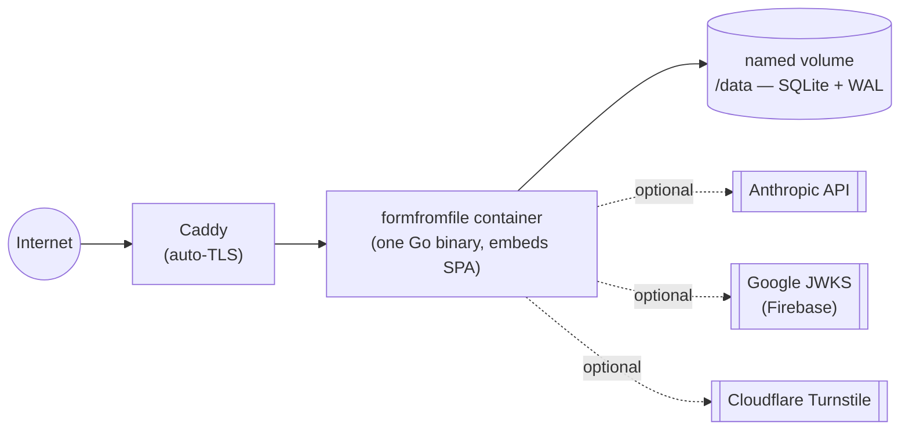

# Diagrams

Companion to [`ARCHITECTURE.md`](ARCHITECTURE.md) — that doc is the
file-by-file walkthrough, these are the shapes. All diagrams are Mermaid;
they render natively on GitHub.

## System overview

In release builds the same binary also serves the SPA's static assets via
`//go:embed all:dist` — there's no separate frontend server or CDN in the
docker-compose deploy path.

## Request flow

Sessions are opaque random tokens; only `sha256(token)` is stored, so a
stolen DB row can't be replayed as a cookie. There's no JWT and nothing to
sign — see `CLAUDE.md` "Why these choices."

## Auth: password vs. Firebase Google

First account ever created — via either path — becomes `admin`. No Firebase
Admin SDK and no service-account key: verification is pure JWT-signature
checking against Google's public keys (see
[`../guides/AUTH.md`](../guides/AUTH.md)).

## Template lifecycle: detect → fill → export → publish → submit

`Designed` can also fork/rollback/version — see `store/schemas.go` and
[`../planning/PLAN-F19.md`](../planning/PLAN-F19.md) for the
versioning/draft-publish/fork model.

## Deployment topology (docker-compose path)

See [`../deployment/DEPLOY.md`](../deployment/DEPLOY.md) for the full
`docker-compose.yml` / `Caddyfile` walkthrough, env vars, backups, and the
pre-handoff checklist; [`../deployment/SCALE.md`](../deployment/SCALE.md)
for where SQLite stops being enough.
